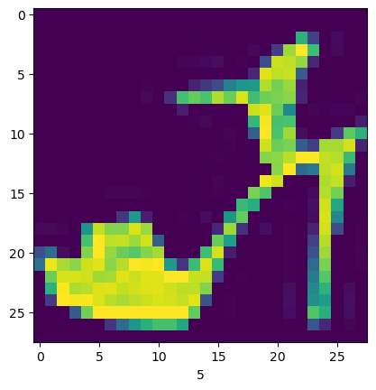
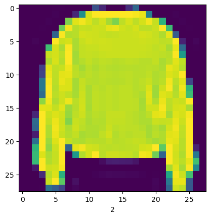
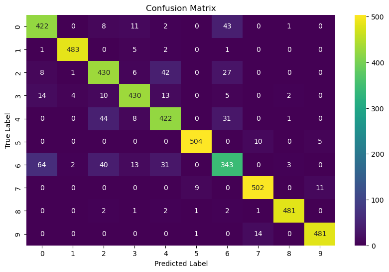

# Fashion-MNIST-Multiclass-Classification
This project builds a multiclass classification model to classify fashion MNIST dataset using Keras

**Objective**
This project builds a multiclass classification model designed to categorize images from the Fashion MNIST dataset.  The model is implemented using the Keras deep learning library, enabling efficient and accurate classification of various types of fashion items such as shirts, shoes, and bags, based on the provided image data.

**Description of the Fashion MNIST dataset**
The dataset consists of 70,000 total samples of fashion items. Each sample is 28*28 pixels.  
The dataset is divided into training and testing sets: 
Training Set = 60,000 samples  
Test Set = 10,000 sample  
The data has 10 classes; therefore, each sample is labeled from 0 to 9.  
The samples are either T-shirt, Trouser, Pullover, Dress, Coat, Sandal, Shirt, Sneaker, Bag, or Ankle boot.  
Samples: 
 

**Steps to run the code**
1. Download the ipynb file and the dataset file.  
2. Upload the notebook on Colab then upload the dataset.  
3. Run the whole code to see the results by yourself.  
**Dependencies and installation instructions**
-Numpy, Pandas,seaborn, Tensorflow, matplotlib, and sklearn 
To install them you can use this command for instalingthem all at once:   
! pip install numpy pandas seaborn tensorflow matplotlib scikit-learn 
or you can install one by one:  
!pip install <dependency_name>

**Expected results and model performance**
The model achieved 90% accuracy on test set.  
The confusion matrix of the model:  

